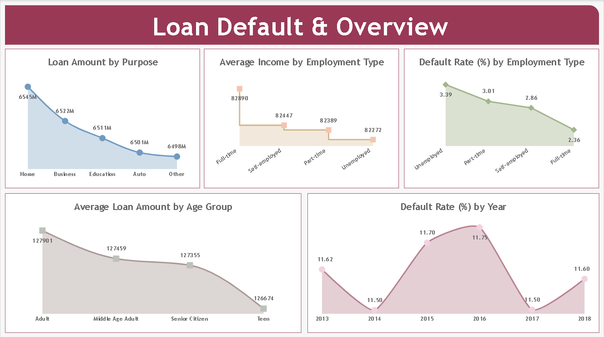
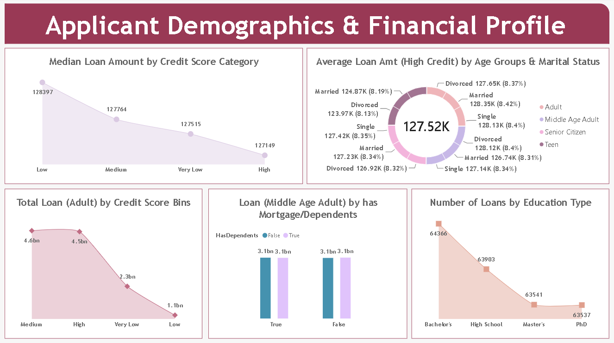
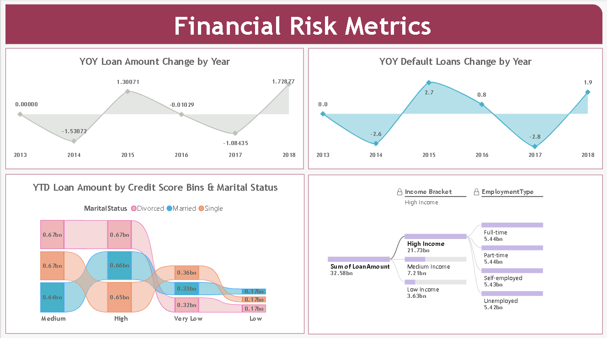

# Loan Default and Financial Risk Analysis



**End-to-end loan default and financial risk analysis using SQL Server, Power BI Service, Standard Gateway, Dataflow Gen1, Power Query, and DAX.**

**[View Interactive Power BI Report](https://app.powerbi.com/links/iFrKrXZT5f?ctid=d0732ed6-a89f-488d-b29d-e5e9e7cdde5c&pbi_source=linkShare)**

## Table of Contents

- [Project Overview](#project-overview)
- [Data Pipeline](#data-pipeline)
- [Technologies Used](#technologies-used)
- [Dataset](#dataset)
- [Data Preparation](#data-preparation)
- [DAX Analysis](#dax-analysis)
- [Dashboard](#dashboard)
- [Refresh and Deployment](#refresh-and-deployment)
- [Repository Structure](#repository-structure)
- [Author](#author)

## Project Overview

This project analyzes loan applications and financial risk factors to understand patterns related to **loan defaults, loan amounts, credit scores, income, employment, demographics, and other applicant characteristics**.

The project follows an end-to-end workflow starting with a CSV dataset imported into SQL Server. SQL Server was connected to Power BI Service using the **On-premises Data Gateway in Standard Mode**. A **Power BI Dataflow Gen1** was then created, and the data was brought into Power BI Desktop for data preparation, analysis, DAX calculations, validation, and dashboard development.

The final report was published to a dedicated Power BI Service workspace, with scheduled and incremental refresh configured.

## Data Pipeline

```text
CSV Dataset
     ↓
SQL Server
     ↓
Standard Mode Gateway
     ↓
Power BI Service
     ↓
Dataflow Gen1
     ↓
Power BI Desktop
     ↓
Power Query
     ↓
Data Cleaning & Transformation
     ↓
DAX Measures & Calculated Columns
     ↓
Data Validation & Analysis
     ↓
Interactive Report
     ↓
Power BI Service Workspace
     ↓
Scheduled Refresh + Incremental Refresh
```

## Technologies Used

- **SQL Server** — stores the loan dataset
- **On-premises Data Gateway (Standard Mode)** — connects SQL Server with Power BI Service
- **Power BI Service** — Dataflow, workspace, publishing, and refresh management
- **Power BI Dataflow Gen1** — provides the SQL Server data source for Power BI Desktop
- **Power BI Desktop** — data preparation, modeling, DAX analysis, and report development
- **Power Query** — data profiling, type management, cleaning, and transformation
- **DAX** — measures, calculated columns, and time-based analysis

## Dataset

**Dataset:** `Loan_default.csv`

The dataset contains applicant, loan, credit, employment, income, and demographic information.

Key fields include:

- Age
- Age Group
- Credit Score
- Credit Score Bins
- DTI Ratio
- Education
- Employment Type
- Has CoSigner
- Has Dependents
- Has Mortgage
- Income
- Income Bracket
- Interest Rate
- Loan Date
- Loan Amount
- Loan ID
- Loan Purpose
- Loan Term
- Marital Status
- Months Employed
- Num Credit Lines
- Year
- Default

A separate `Column+Definitions.xlsx` file is included with descriptions of the dataset fields.

## Data Preparation

After loading the data into Power BI Desktop through the Dataflow, data preparation was performed in **Power Query**.

The preparation included:

- Reviewing column quality and data profiling
- Assigning appropriate data types
- Preparing date and numeric fields
- Creating analytical categories such as **Age Group**, **Credit Score Bins**, and **Income Bracket**
- Preparing the dataset for DAX calculations and visualization


## DAX Analysis

DAX was used to create measures and calculated columns for financial and risk analysis.

### Key DAX Functions Used

```text
SUMX
FILTER
NOT
ISBLANK
CALCULATE
AVERAGE
ALLEXCEPT
ALL
COUNTROWS
DIVIDE
AVERAGEX
VALUES
MEDIANX
SUM
SWITCH
```

### Key Measures

The report includes measures for:

- Loan Amount by Purpose
- Average Income by Employment Type
- Default Rate by Employment Type
- Average Loan Amount by Age Group
- Default Rate by Year
- Median Loan Amount by Credit Score Category
- Loans by Education Type
- Total Loan by Credit Score Bins
- Total Loan by Mortgage/Dependents
- Average Loan Amount for High Credit applicants
- YOY Loan Amount Change
- YOY Default Loans Change
- YTD Loan Amount

Time-based measures were developed using year-over-year and year-to-date analysis.


## Dashboard

The report contains three main analytical pages.

### 1. Loan Default & Overview

Provides an overview of:

- Loan Amount by Purpose
- Average Income by Employment Type
- Default Rate by Employment Type
- Average Loan Amount by Age Group
- Default Rate by Year


### 2. Applicant Demographics & Financial Profile

Analyzes:

- Median Loan Amount by Credit Score Category
- Average Loan Amount by Age Group and Marital Status
- Total Loan by Credit Score Bins
- Loan Amount by Mortgage and Dependents
- Number of Loans by Education Type



### 3. Financial Risk Metrics

Focuses on:

- YOY Loan Amount Change by Year
- YOY Default Loans Change by Year
- YTD Loan Amount by Credit Score Bins and Marital Status
- Decomposition Tree analysis using income and employment segments



## Data Validation

Validation was performed for key DAX measures and visuals by comparing calculated results with the underlying dataset.

Validation was carried out for areas including:

- Average Loan Amount by Age Group
- Default Rate by Year
- Median Loan Amount
- Donut Chart analysis
- Loan analysis by credit categories
- Loans by Education Type

This helped verify the accuracy of the calculations before finalizing the report.

## Refresh and Deployment

### Dataflow Refresh

Scheduled refresh was configured for the Power BI Dataflow.

### Incremental Refresh

Incremental refresh was configured for the Dataflow to support efficient refresh of changing data.

### Report Publishing

The completed report was published to a dedicated **Power BI Service workspace**.

Report refresh was also configured in Power BI Service to keep the published report updated.


## Repository Structure

```text
Loan-Default-and-Financial-Risk-Analysis/
│
├── data/
│   ├── Column+Definitions.xlsx
│   └── Loan_default.csv
│
├── powerbi/
│   └── dashboard.pbix
│
├── screenshots/
│   ├── Loan_default columns.png
│   ├── measures ss.png
│   ├── powerbi service dataflow ss.png
│   ├── screenshot1.png
│   ├── screenshot2.png
│   └── screenshot3.png
│
└── README.md
```

## Author

**Manisha Rajan**

Data Analyst | SQL • Excel • Power BI • Python
